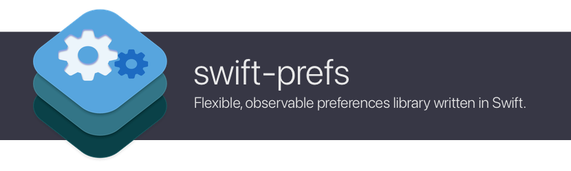

# swift-prefs

[](https://swiftpackageindex.com/orchetect/swift-prefs) [](https://swiftpackageindex.com/orchetect/swift-prefs) [](https://developer.apple.com/swift) [](https://github.com/orchetect/swift-prefs/blob/main/LICENSE)

A modern Swift library for reading & writing app preferences:

- concise and powerful declarative DSL
- swappable/mockable storage backend (UserDefaults, Dictionary, PList file, and more)
- keys are implicitly `@Observable` and `@Bindable` for effortless integration in modern SwiftUI apps
- composable, chainable encoding strategies
- built from the ground up for Swift 6 and strict concurrency

## Table of Contents

- [Quick Start](#Quick-Start)
- [Documentation](#Documentation)
  - [Storage Value Types](#Storage-Value-Types)
  - [Storage Injection](#Storage-Injection)
  - [Key Naming](#Key-Naming)
  - [Custom Value Coding](#Custom-Value-Coding)
  - [Composing Value Coding Strategies](#Composing-Value-Coding-Strategies)
  - [Dynamic Key Access](#Dynamic-Key-Access)
  - [Mixed Value Type Collections](#Mixed-Value-Type-Collections)
  - [Importing and Exporting Storage](#Importing-and-Exporting-Storage)
  - [Custom Storage Backend](#Custom-Storage-Backend)
  - [Using Actors](#Using-Actors)
- [FAQ](#FAQ)

## Quick Start

1. Add swift-prefs to your app or package
2. Create a schema that defines the backing storage and preference key/value types.
   - Apply the `@PrefsSchema` attribute to the class.
   - Define your `storage` and `storageMode` using the corresponding `@Storage` and `@StorageMode` attributes.
   - Use the `@Pref` attribute to declare individual preference keys and their value type.
     Value types may be `Optional` or have a default value.
   ```swift
   import Foundation
   import SwiftPrefs
   
   @PrefsSchema final class Prefs {
       @Storage var storage = .userDefaults
       @StorageMode var storageMode = .cachedReadStorageWrite
       
       @Pref var foo: String?
       @Pref var bar: Int = 123
       @Pref var bool: Bool = false
       @Pref var stringArray: [String]?
       @Pref var intDictionary: [String: Int]?
   }
   ```
> [!TIP]
>
> For a list of available storage value types, see [Storage Value Types](#Storage-Value-Types).
3. Instantiate the class in the appropriate scope. If you are defining application preferences, the `App` struct is a good place to store it. It may be passed into the environment so that any subview can access it.
   ```swift
   struct MyApp: App {
       @State private var prefs = Prefs()
       
       var body: some Scene {
           WindowGroup {
               ContentView()
                   .environment(prefs)
           }
       }
   }
   ```
4. The class is implicitly `@Observable` so its properties can trigger SwiftUI view updates and be used as bindings.
   ```swift
   struct ContentView: View {
       @Environment(Prefs.self) private var prefs
       
       var body: some View {
           Text("String: \(prefs.foo ?? "Not yet set.")")
           Text("Int: \(prefs.bar)")
           
           @Bindable var prefs = prefs
           Toggle("State", isOn: $prefs.bool)
       }
   }
   ```

## Documentation

### Storage Value Types

#### Atomic Value Types

These are the atomic value types supported:

| Atomic Type | Usage                              | Description                                             |
| ----------- | ---------------------------------- | ------------------------------------------------------- |
| `String`    | `@Pref var x: String = ""`         | An atomic `String` value                                |
| `Bool`      | `@Pref var x: Bool = true`         | An atomic `Bool` value                                  |
| `Int`       | `@Pref var x: Int = 1`             | An atomic `Int` value                                   |
| `Double`    | `@Pref var x: Double = 1.0`        | An atomic `Double` value                                |
| `Float`     | `@Pref var x: Float = 1.0`         | An atomic `Float` value                                 |
| `Data`      | `@Pref var x: Data = Data()`       | An atomic `Data` value                                  |
| `Date`      | `@Pref var x: Date = Date()`       | An atomic `Date` value using NSDate encoding by default |
| Array       | `@Pref var x: [Int] = []`          | Array of a single atomic value type                     |
| Dictionary  | `@Pref var x: [String: Int] = [:]` | Keyed by `String` with a single atomic value type       |
| Raw Array   | `@RawPref var x: [Any] = []`       | Array of unsafe (untyped) elements                      |
| Raw Dictionary   | `@RawPref var x: [String: Any] = [:]`      | Dictionary of unsafe (untyped) elements                      |

> [!NOTE]
>
> Access to raw arrays (mixed value types) (`[Any]`) or dictionaries (`[String: Any]`) is an advanced feature and should be used with caution. See [Mixed Value Type Collections](#Mixed-Value-Type-Collections) for more details.

#### Storage Type Coercion and Basic Atomic Value Conversion

Various common type conversions are also provided as part of the library.

> [!NOTE]
>
> Many non-atomic types, such as fixed-width integers (`UInt8`, `Int32`, etc.) may be used but the explicit coding strategy must be supplied. This is required (and not automatic) so that there is no ambiguity as to a value's underlying storage type.

##### Storing binary integer types as an atomic `Int`

```swift
@PrefsSchema final class Prefs {
    @Pref(coding: .uIntAsInt) var foo: UInt?
    
    @Pref(coding: .int8AsInt) var foo: Int8?
    @Pref(coding: .uInt8AsInt) var foo: UInt8?
    
    @Pref(coding: .int16AsInt) var foo: Int16?
    @Pref(coding: .uInt16AsInt) var foo: UInt16?
    
    @Pref(coding: .int32AsInt) var foo: Int32?
    @Pref(coding: .uInt32AsInt) var foo: UInt32?
    
    @Pref(coding: .int64AsInt) var foo: Int64?
    @Pref(coding: .uInt64AsInt) var foo: UInt64?
}
```

##### Storing fixed-width integer types as an atomic `String`

```swift
@PrefsSchema final class Prefs {
    @Pref(coding: .intAsString) var foo: Int?
    @Pref(coding: .uIntAsString) var foo: UInt?
    
    @Pref(coding: .int8AsString) var foo: Int8?
    @Pref(coding: .uInt8AsString) var foo: UInt8?
    
    @Pref(coding: .int16AsString) var foo: Int16?
    @Pref(coding: .uInt16AsString) var foo: UInt16?
    
    @Pref(coding: .int32AsString) var foo: Int32?
    @Pref(coding: .uInt32AsString) var foo: UInt32?
    
    @Pref(coding: .int64AsString) var foo: Int64?
    @Pref(coding: .uInt64AsString) var foo: UInt64?
}
```

> [!TIP]
>
> Sometimes for compatibility with certain storage requirements, storing an integer as a string may be necessary.
>
> It can also be preferable for technical reasons, such as where `Int` as a storage type may overflow. For example, when using `UInt64` as nominal type (or Swift 6's new `Int128`/`UInt128`), when stored as a `String` it avoids otherwise potentially overflowing `Int` and failing to store the value.

##### Storing `Bool` as `Int`

Storing a boolean as an integer (`1` or `0`):

```swift
@PrefsSchema final class Prefs {
    @Pref(coding: .boolAsInt()) var foo: Bool?
}
```

##### Storing `Bool` as `String`

Storing a boolean as a string gives granular control over storage semantics:

- `true`/`false`, `yes`/`no`, or custom strings
- capitalized (`TRUE`), lowercase (`true`), or uppercase (`True`)

```swift
@PrefsSchema final class Prefs {
    @Pref(coding: .boolAsString(.trueFalse(.lowercase))) var foo: Bool?
}
```

##### Storing `Date` as ISO-8601 `String`

```swift
@PrefsSchema final class Prefs {
    @Pref(coding: .iso8601DateString) var date: Date?
}
```

##### Storing `URL` as `String`

```swift
@PrefsSchema final class Prefs {
    @Pref(coding: .urlString) var foo: URL?
}
```

### Storage Injection

For more complex scenarios, a `@PrefsSchema` class can have its storage backend and/or storage mode set at class init.

One method is by way of type-erasure using the concrete type `AnyPrefsStorage` and passing your storage of choice in.

```swift
@PrefsSchema final class Prefs {
    @Storage var storage: AnyPrefsStorage
    @StorageMode var storageMode: PrefsStorageMode
    
    init(storage: any PrefsStorage, storageMode: PrefsStorageMode) {
        self.storage = AnyPrefsStorage(storage)
        self.storageMode = storageMode
    }
}
```

Another method is by way of generics if, for example, you know the storage backend will always be a dictionary.

The benefit of this approach is that it gives access to type-specific members of the concrete storage type instead of only protocolized `PrefsStorage` members. For example, typing as `DictionaryPrefsStorage` adds methods to load and save storage contents to/from a plist file.

```swift
@PrefsSchema final class Prefs {
    @Storage var storage: DictionaryPrefsStorage
    @StorageMode var storageMode: PrefsStorageMode
    
    init(storage: DictionaryPrefsStorage, mode: PrefsStorageMode) {
        self.storage = storage
        storageMode = mode
    }
}
```

### Key Naming

Key names are synthesized from the var name unless specified:

```swift
// storage key name is "foo"
@Pref var foo: String?

// storage key name is "bar"
@Pref(key: "bar") var foo: String?
```

### Custom Value Coding

#### `RawRepresentable`

Allows using a `RawRepresentable` type with a `RawValue` that is one of the supported atomic storage value types.

```swift
enum Fruit: String {
    case apple, banana, orange
}
```

1. Using convenience macro:
   ```swift
   @PrefsSchema final class Prefs {
       @RawRepresentablePref var fruit: Fruit?
   }
   ```
2. Using the `Pref(coding:)` macro, which also allows for chaining of coding strategies.
   
   Due to Swift macro type system limitations, the base coding strategy must be specified by using a static constructor on its concrete type:
   
   ```swift
   @PrefsSchema final class Prefs {
       @Pref(coding: Fruit.rawRepresentablePrefsCoding) var fruit: Fruit?
   }
   ```

##### `[RawRepresentable]`

It is possible to store an array of a `RawRepresentable` type with a `RawValue` that is one of the supported atomic storage value types.

Due to Swift macro type system limitations, the base coding strategy must be specified by using a static constructor on its concrete type:

```swift
@PrefsSchema final class Prefs {
    @Pref(coding: [Fruit].rawRepresentableArrayPrefsCoding) var fruit: [Fruit]?
}
```

##### `[String: RawRepresentable]`

It is possible to store a dictionary keyed by `String` with values of a `RawRepresentable` type with a `RawValue` that is one of the supported atomic storage value types.

Due to Swift macro type system limitations, the base coding strategy must be specified by using a static constructor on its concrete type:

```swift
@PrefsSchema final class Prefs {
    @Pref(coding: [String: Fruit].rawRepresentableDictionaryPrefsCoding)
    var fruit: [String: Fruit]?
}
```

#### `Codable`

Several syntax options are available to encode and decode any `Codable` type as JSON using either `Data` or `String` raw storage.

```swift
struct Device: Codable {
    var name: String
    var manufacturer: String
}
```

1. Using convenience macros:
   ```swift
   @PrefsSchema final class Prefs {
       // encode Device as JSON using Data storage
       @JSONDataCodablePref var device: Device?
       
       // encode Device as JSON using String storage
       @JSONStringCodablePref var device: Device?
   }
   ```
2. Using the `Pref(coding:)` macro, which also allows for chaining of coding strategies.
   
   Due to Swift macro type system limitations, the base coding strategy must be specified by using a static constructor on its concrete type:
   
   ```swift
   @PrefsSchema final class Prefs {
       // encode Device as JSON using Data storage
       @Pref(coding: Device.jsonDataPrefsCoding) var device: Device?
       
       // encode Device as JSON using String storage
       @Pref(coding: Device.jsonStringPrefsCoding) var device: Device?
   }
   ```

##### `[Codable]`

It is possible to store an array of a `Codable` type as JSON using either `Data` or `String` raw storage.

Due to Swift macro type system limitations, the base coding strategy must be specified by using a static constructor on its concrete type:

```swift
// option #1:
// collection stored in storage as an array of encoded Data or String elements
@PrefsSchema final class Prefs {
    // encode a Device array as an array of JSON elements using Data storage
    @Pref(coding: [Device].jsonDataArrayPrefsCoding) var device: [Device]?
    
    // encode a Device array as an array of JSON elements using String storage
    @Pref(coding: [Device].jsonStringArrayPrefsCoding) var device: [Device]?
}

// option #2:
// collection stored in storage as a single encoded Data blob or String
@PrefsSchema final class Prefs {
    // encode a Device array as an array of JSON elements using Data storage
    @Pref(coding: [Device].jsonDataPrefsCoding) var device: [Device]?
    
    // encode a Device array as an array of JSON elements using String storage
    @Pref(coding: [Device].jsonStringPrefsCoding) var device: [Device]?
}
```

##### `[String: Codable]`

It is possible to store a dictionary keyed by `String` with values of a `Codable` type as JSON using either `Data` or `String` raw storage.

Due to Swift macro type system limitations, the base coding strategy must be specified by using a static constructor on its concrete type:

```swift
@PrefsSchema final class Prefs {
    // encode a Device array as an array of JSON elements using Data storage
    @Pref(coding: [String: Device].jsonDataDictionaryPrefsCoding)
    var device: [String: Device]?
    
    // encode a Device array as an array of JSON elements using String storage
    @Pref(coding: [String: Device].jsonStringDictionaryPrefsCoding)
    var device: [String: Device]?
}
```

#### Implementing Custom Coding Strategies

For more advanced coding requirements, the library supports defining custom *value ←→ storage value* encoding implementations.

```swift
struct MyType {
    var value: String
    init?(value: String) { /* ... */ }
}
```

1. Simple ad-hoc coding logic can be done inline:
   ```swift
   @PrefsSchema final class Prefs {
       @Pref(encode: { $0.value }, decode: { MyType(value: $0) })
       var foo: MyType?
   }
   ```
2. If coding implementation is more complex and/or will be reused with multiple preference keys, it can be defined once by creating a new type that conforms to `PrefsCodable`, then supplied to each `@Pref` declaration using the `coding` parameter:
   ```swift
   @PrefsSchema final class Prefs {
       // coding instance may be supplied directly, or...
       @Pref(coding: MyTypePrefsCoding()) var foo: MyType?
       
       // ...static constructor may be used, if defined (see extension below)
       @Pref(coding: .myType) var bar: MyType?
   }
   
   // Type defining coding logic
   struct MyTypePrefsCoding: PrefsCodable {
       func encode(prefsValue: MyType) -> Data? {
           prefsValue.value.data(using: .utf8)
       }
       func decode(prefsValue: Data) -> MyType? {
           guard let string = String(data: prefsValue, encoding: .utf8) else { return nil }
           return MyType(value: string)
       }
   }
   
   // Static constructor (for syntactic sugar / convenience)
   extension PrefsCodable where Self == MyTypePrefsCoding {
       static var myType: MyTypePrefsCoding { MyTypePrefsCoding() }
   }
   ```

> [!NOTE]
>
> This approach of defining a custom `PrefsCodable` implementation is ideal when the type being encoded is either:
> - a type that you do not own (ie: from another framework), or
> - when the type may have more than one possible encoding format, or
> - a type whose encoding format has changed over time and generational formats need to be maintained (ie: for legacy preferences migration)
>
> If it is for a custom type that is one you own and there is only one encoding format for it, an alternative approach is to conform it to Swift's `Codable` instead and use `@JSONDataCodablePref` or `@JSONStringCodablePref` to store it.

### Composing Value Coding Strategies

For more complex preference value coding scenarios, two or more coding strategies may be chained in series in order to compose multiple steps in the encoding/decoding process.

By way of example, a custom type that conforms to `Codable` could be first encoded to its data representation, then compressed, then encoded to a base-64 encoded `String` as its final preferences storage format. When the value is read back from storage, the decoding process naturally occurs in the reverse order.

```swift
@PrefsSchema final class Prefs {
    @Pref(
        coding: MyType
            .jsonDataPrefsCoding
            .compressedData(algorithm: .lzfse)
            .base64DataString()
    ) var foo: MyType?
}

struct MyType: Codable {
    var id: Int
    var content: String
}
```

### Dynamic Key Access

In complex projects it may be necessary to access the prefs storage directly using preference key(s) that may only be known at runtime.

The storage property may be accessed directly using `value(forKey:)` and `setValue(forKey:to:)` methods.

```swift
@PrefsSchema final class Prefs {
    // @Pref vars are Observable and Bindable in SwiftUI views
    @Pref var foo: Int?
    
    // `storage` access is NOT Observable or Bindable in SwiftUI views
    func fruit(name: String) -> String? {
        storage.storageValue(forKey: "fruit-\(name)")
    }
    func setFruit(name: String, to newValue: String?) {
        storage.setStorageValue(forKey: "fruit-\(name)", to: newValue)
    }
}
```

> [!NOTE]
> 
> Mutating storage directly does not inherit the `@Observable` behavior of `@Pref`-defined keys, which inherently means this type of access cannot be used in a SwiftUI Binding. For these reasons it is ideal that the prefs schema contain root-level preference keys that are known at compile time where possible.

### Mixed Value Type Collections

To ensure type safety, mixed value types in arrays (aka `[Any]`) or dictionaries (aka `[String: Any]`) are treated differently in a prefs schema, using the `@RawPref` type declaration.

The library typically restricts types to safe atomic types to ensure compatibility between different storage backends (UserDefaults, plist, etc.) but these raw types may be used in edge cases where more flexibility is required with less safety.

Raw access to preference keys can be used as an accommodation for migrating from an old prefs storage format to one that is compatible with `@PrefsSchema`.

```swift
@PrefsSchema final class Prefs {
    @RawPref var array: [Any]?
    @RawPref var defaultedArray: [Any] = ["foo", 123, true]
    
    @RawPref var dict: [String: Any]?
    @RawPref var defaultedDict: [String: Any] = ["foo": "string", "bar": 123]
}
```

> [!IMPORTANT]
>
> While any type may be accommodated when using a **dictionary** prefs storage backend, it is generally recommended to restrict usage of `@RawPref` to arrays and dictionaries containing valid atomic value types so that these preferences can still be serialized later.
>
> When using the UserDefaults storage backend, this is even more important as it will not commit value types to persistent system storage if they are non-atomic value types.

> [!TIP]
>
> As an alternative to directly accessing mixed type collections, consider creating a `Codable` type that can serialize them through [`@Pref`'s support for `Codable` types](#Codable).

## Importing and Exporting Storage

All prefs storage backends can import and export from various file and data formats.

The library ships with support for two serialization formats:

- plist (property list), which can convert 1:1 with `PrefsStorage` atomic value types
- JSON, which can convert most value types with `PrefsStorage`, but requires custom implementation for some value types before they can be converted

### Importing Storage

Serialized data may be imported from three different overloads:

- from a file `URL` on disk
- file contents as `Data`
- file contents as `String`

There are two main mechanisms for importing data into a concrete `PrefsStorage`:

#### 1. At time of storage initialization

Certain prefs storage backends support importing through `init(from:format:)`.

> [!NOTE]
>
> Dictionary prefs storage supports importing from an initializer, but UserDefaults prefs storage does not.

```swift
@PrefsSchema final class Prefs {
    @Storage var storage: DictionaryPrefsStorage
    @StorageMode var storageMode = .cachedReadStorageWrite
    
    init(plist file: URL) throws {
        storage = try DictionaryPrefsStorage(from: file, format: .plist())
    }
    init(plist data: Data) throws {
        storage = try DictionaryPrefsStorage(from: data, format: .plist())
    }
    init(plist xmlString: String) throws {
        storage = try DictionaryPrefsStorage(from: xmlString, format: .plist())
    }
}
```

#### 2. During the storage object's lifetime

The `load(from:format:by:)` method allows either replacing existing storage or merging its contents into existing storage.

> [!WARNING]
>
> Loading data using these methods does not actively update the prefs schema's cache, and as such requires the use of `storageOnly` storage mode.

```swift
@PrefsSchema final class Prefs {
    @Storage var storage = .dictionary
    @StorageMode var storageMode = .storageOnly // ⚠️ important for load(...) methods
}
let prefs = Prefs()
```

```swift
// load plist file content from a file on disk
try prefs.storage.load(from: URL(/* ... */), format: .plist(), by: .reinitializing)
```

```swift
// load raw plist file content
try prefs.storage.load(from: Data(/* ... */), format: .plist(), by: .reinitializing)
```

```swift
// load plist content in the form of XML string
try prefs.storage.load(from: /* plist XML string */), format: .plist(), by: .reinitializing)
```

### Importing Deserialized Storage

The `load(from: [String: any PrefsStorageValue])` or `load(unsafe: [String: Any])` methods allow loading dictionary contents into existing storage.

These methods allow either replacing existing storage or merging its contents into storage.

Storage contents can be imported from a dictionary at any time during the storage object's lifetime.

> [!WARNING]
>
> Loading data using these methods does not actively update the prefs schema's cache, and as such requires the use of `storageOnly` storage mode.

```swift
@PrefsSchema final class Prefs {
    @Storage var storage = .dictionary
    @StorageMode var storageMode = .storageOnly // ⚠️ important for load(...) methods
}
let prefs = Prefs()
```

```swift
// load stongly-typed content (safe)
let newContent: [String: any PrefsStorageValue] = /* ... */
try prefs.storage.load(from: newContent, by: .updating)
```

```swift
// load dictionary content with values typed as Any if you have
// prior knowledge they are valid prefs storage atomic value types,
// such as if your codebase has an API that gives you plist dictionary contents
// which is 1:1 compatible with `PrefsStorage`
let plistContent: [String: Any] = /* ... */
try prefs.storage.load(unsafe: plistContent, by: .updating)
```

### Exporting Storage

Serialized data may be exported to any of three different overloads:

- `export(format:, to: URL)`: write to a file `URL` on disk
- `exportData(format:)` returns file contents as `Data` 
- `exportString(format:)` returns file contents as `String` 

Storage contents may be exported at any time during the storage object's lifetime.

```swift
@PrefsSchema final class Prefs {
    @Storage var storage = .dictionary
    @StorageMode var storageMode = .cachedReadStorageWrite
}
let prefs = Prefs()
```

```swift
// export storage as plist file on disk
try prefs.storage.export(format: .plist(), to: URL(/* ... */))
```

```swift
// export storage as raw plist file data
let data = try prefs.storage.exportData(format: .plist())
```

```swift
// export storage as plist file content in the form of XML string
let xmlString = try prefs.storage.exportString(format: .plist())
```

### Custom Import/Export Formats

The library offers plist (property list) and JSON import/export formats, but custom formats may be implemented.

- Create an import type conforming to the `PrefsStorageImportFormat` protocol
- Create an export type conforming to the `PrefsStorageExportFormat` protocol

Formats employ a strategy for processing or converting value types. The library offers several basic strategies, but custom strategies may be implemented.

- Create an import strategy type conforming to the `PrefsStorageImportStrategy` protocol
- Create an export strategy type conforming to the `PrefsStorageExportStrategy` protocol

## Custom Storage Backend

While the library offers concrete storage backends that cover the vast majority of use cases (dictionary and UserDefaults), custom backends may be implemented by conforming to the `PrefsStorage` protocol.

Additionally:

- conforming to `PrefsStorageInitializable` allows the storage to initialize from other storage formats
- conforming to `PrefsStorageImportable` allows storage contents to be imported or merged from other storage formats
- conforming to `PrefsStorageExportable` allows storage contents to be exported to other storage formats

### Using Actors

In Swift 6.2 (Xcode 26+), `@MainActor` can be directly attached to the class declaration to make the class bound to the main actor.

```swift
@MainActor @PrefsSchema final class Prefs { /* ... */ }
```

Alternatively, if you do not want the class to be bound to `@MainActor`, actors may be attached to individual `@Pref` preference declarations. This is supported for older versions of Swift/Xcode.

```swift
@PrefsSchema final class Prefs {
    @Storage var storage = .userDefaults
    @StorageMode var storageMode = .cachedReadStorageWrite
    
    @MainActor @Pref var foo: Int? // <-- access to this pref is bound to main actor
    
    @Pref var bar: String?
}
```

> [!NOTE]
>
> This may be subject to change in future versions of swift-prefs.

## FAQ

- **Why use swift-prefs?**

  Offering users customization points in your software is a foundational way to offer a great user experience — but it's not the main event. You'd rather be putting time and resources into developing the actual features users are customizing than dealing with the overhead of how these options are stored and handled. And so often the problem is handled by way of path of least resistance, which usually goes something like "just use `UserDefaults` and move on" or "`@AppStorage` is good enough, right?"

  The danger of this convenient low-hanging fruit is the tech debt it inevitably creates over time. As a project grows and changes shape, its needs increase, and its automated testing requirements broaden. By then, large portions of the codebase are tightly coupled with implementation details (ie: `UserDefaults` access) and refactors to allow modular preferences become increasingly expensive.

  So, tired of every project having a haphazard approach to handling preferences — and inspired by patterns in first-party Apple packages such as SwiftData — a one-stop shop solution was built. It's simple, powerful, and uses modern Swift language features to allow preferences to be declarative while hiding implementation details so you can get on with the important stuff - like building features users care about. It can be minimal so it's easy to set up for small projects, but it can also scale for projects with larger demands.

- **Why not just use `@AppStorage`?**

  The 1st-party provided `@AppStorage` property wrapper is convenient and perfectly fine for small apps that do not require robust storage flexibility or prefs isolation / mocking for integration testing or unit testing.

  It also is fairly limited in the value types it supports. swift-prefs offers an easy to use, extensible blueprint for defining and using encoding strategies for any value type.

- **Why not just use SwiftData?**

  SwiftData is more oriented towards data models and user document content. It requires some adaptation and boilerplate to shoehorn it into the role of application preferences storage. It also has a somewhat steep learning curve and may contain more features than are necessary.

  swift-prefs is purpose-built for preference storage.

- **Why not just use `UserDefaults` directly?**

  For small apps this approach may be adequate. However it forms tight coupling to `UserDefaults` as a storage backend. This means automated integration testing can't as easily be performed with isolated/mocked preferences. Even if the approach of using separate `UserDefaults` suites for testing is employed, the coupling makes changing storage backend in the future more time-intensive.

  swift-prefs adds the ability to swap out the storage backend at any time in the future, in addition to its easy to use, extensible blueprints for defining and using encoding strategies for value types.

## Installation

### Swift Package Manager (SPM)

To add this package to an Xcode app project, use:

 `https://github.com/orchetect/swift-prefs` as the URL.

To add this package to a Swift package, add the dependency to your package and target in Package.swift:

```swift
let package = Package(
    dependencies: [
        .package(url: "https://github.com/orchetect/swift-prefs", from: "2.0.0")
    ],
    targets: [
        .target(
            dependencies: [
                .product(name: "SwiftPrefs", package: "swift-prefs")
            ]
        )
    ]
)
```

Note that the library makes use of [Swift Macros](https://docs.swift.org/swift-book/documentation/the-swift-programming-language/macros/) and because of this, Xcode will prompt you to allow macros for this package. It will ask again any time a new release of the package is available and you update to it.

## Author

Coded by a bunch of 🐹 hamsters in a trench coat that calls itself [@orchetect](https://github.com/orchetect).

## License

Licensed under the MIT license. See [LICENSE](https://github.com/orchetect/swift-prefs/blob/master/LICENSE) for details.

## Community & Support

Please do not email maintainers for technical support. Several options are available for issues and questions:

- Questions and feature ideas can be posted to [Discussions](https://github.com/orchetect/swift-prefs/discussions).
- If an issue is a verifiable bug with reproducible steps it may be posted in [Issues](https://github.com/orchetect/swift-prefs/issues).

## Contributions

Contributions are welcome. Posting in [Discussions](https://github.com/orchetect/swift-prefs/discussions) first prior to new submitting PRs for features or modifications is encouraged.

## Legacy

This repository was formerly known as PrefsKit.
